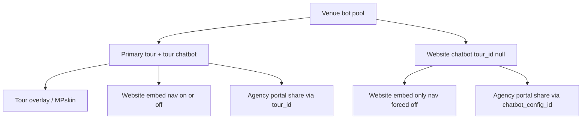

# Website-only chatbot + pricing

## Locked product decisions

- Billing unit name: **bot**.
- One bot = **either** one active primary tour location (with its tour chatbot) **or** one standalone website chatbot.
- Tour chatbots keep today’s Share & Embed behaviour (can still sit on a website with navigation on/off). Website chatbots need **no Matterport tour**.
- **Agency clients too**: add-client can create a website-only portal (no Matterport required).

## Product model

| Kind | Consumes a bot? | Requires Matterport? | Embed |
|------|-----------------|----------------------|-------|
| Primary tour (+ tour chatbot) | Yes | Yes | Tour overlay + website embed (`nav` on/off) |
| Secondary tour | No | Yes | Under parent |
| Tour chatbot config | No (rides on tour) | Via tour | Same as tour |
| Website chatbot (`chatbot_type='website'`, `tour_id` null) | **Yes** | No | Website embed only; navigation forced off |

Bots used = `active primary tours` + `website chatbot_configs` for the venue.

## Pricing copy

See marketing components: `PricingHero.tsx`, `PricingPlans.tsx`, `PricingFAQ.tsx`, and Terms Bot definition.

- One bot = tour location **or** standalone website chatbot.
- Extra bot add-on = another slot of either type (+1,000 messages).

## Schema

Migration: `sql/85_website_chatbots.sql`

1. `chatbot_configs`: nullable `tour_id`; `chatbot_type in ('tour','website')`; partial unique on `tour_id`; website ⇒ null tour; tour ⇒ required tour.
2. Dependents: documents, customisations, triggers, hard limits, rate limits, conversations, embed stats — allow `website`.
3. RLS: public reads for active website configs without joining tours.
4. `agency_portal_shares`: nullable `tour_id`; `chatbot_config_id`; exactly one of tour / config.

Billing unit rename: `sql/87_billing_unit_rename_space_to_bot.sql` (`included_bots`, `addon_extra_bots`, `extra_bot` / `agency_extra_bot`). Stripe product names were renamed in place (Additional Space → Additional Bot); **price IDs unchanged** — no separate price-ID SQL.

## Bot accounting

`lib/server/venue-bot-limits.ts` — `getVenueBotLimit` + `countBotsUsed`.

Wired into tour create, website chatbot create, Agency add-client, dashboard, locations UI, Agency settings.

## App / Agency

- Config create without tour; public resolve by `chatbotConfigId`; embed without Matterport.
- Chatbots page: slot list (tours + website bots); create website flow.
- Agency add-client: Tour client **or** Website chatbot client.

## Out of scope for v1

- Fake Matterport / placeholder tours.
- Separate Stripe SKU for website chatbots.
- Server-side Free-plan embed hard-block.
