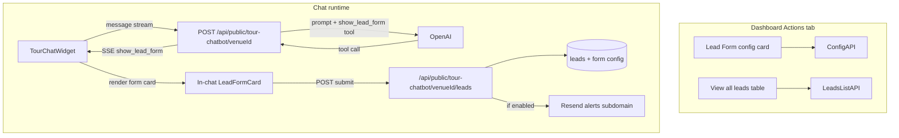

# Lead Form — Implementation Plan

> Status: PLANNING. Author: TourBots engineering. Last updated: 18/07/2026 (rev 2 — review feedback incorporated).
> Rebuild of venue chatbot lead capture from scratch. The previous half-built pipeline (`lib/leads/*`, scoring services, `/api/app/leads/**`) was removed in July 2026 — it was never wired to a capture form and never had a tracked SQL migration. This document is the build plan for shipping an in-chat lead form on the **Actions** tab, end-to-end: configure → trigger → render in chat → persist → optional email → leads table.

---

## 1. Why we're doing this

Venue customers need a clean way to capture visitor details (name, email, phone, custom fields) from the tour chatbot conversation — not a separate page form, and not a dead scoring pipeline.

Product intent (from `docs/devlist.txt` + owner decisions):

- A **Lead Form** section on **Chatbots → Actions**, under Chatbot Triggers.
- Operators define **fields** and which are **required**.
- Operators define **how the form is shown** in chat:
  - **Intent** — AI judges whether the visitor’s meaning matches your description (same as chatbot triggers).
  - **Keywords** — same AI-judged pattern, with keyword hints.
- Optional **email notification** when a lead is submitted.
- **View all leads** opens a table of every lead for that chatbot (tour-attached or standalone).
- Works for **standalone website chatbots** (navigation off / no tour context) as well as tour overlays — lead capture matters most when the visitor has nowhere else to go.
- **GDPR consent** on the public form in v1 (checkbox + privacy policy link).
- New tracked SQL migration(s) before any writes.
- Do **not** resurrect the old scoring / activity / sales-lead code.

---

## 2. What we're building (plain English)

### Operator experience (dashboard)

1. Open **Chatbots → Actions**.
2. Under the (default-collapsed) **Chatbot Triggers** card, see a new **Lead Form** card (same visual language: collapsible card, compact header actions).
3. Configure:
   - Enable / disable the lead form.
   - Intro line shown above the mini form in chat.
   - Fields: add/remove/reorder; each has label, type (`text` / `email` / `phone` / `textarea` / `select`), required toggle, placeholder; select fields also get an options list.
   - **When to show**: Intent | Keywords (with the matching inputs).
   - Privacy consent label + privacy policy URL.
   - Optional email notifications: toggle + notification address (defaults to venue email).
4. Click **View all leads** → in-panel table of submissions (newest first).
5. Save.

### Visitor experience (chat)

1. Visitor chats as today (tour overlay **or** standalone website chatbot embed).
2. When the lead-form condition applies, the AI may call a new tool `show_lead_form`.
3. The widget receives an SSE event and inserts a **compact, themed form card** into the transcript (not markdown).
4. Visitor fills required fields, ticks the **privacy consent** checkbox, then Submit.
5. Form swaps to a short confirmation; data is stored (including consent timestamp); optional email fires to the venue.

---

## 3. Decisions locked

| Decision | Choice |
|----------|--------|
| Placement | Actions tab, section **below** Chatbot Triggers |
| Triggers card | Remains default-collapsed |
| Show conditions | `keywords` \| `intent` only (same AI-judged pattern as chatbot triggers; no separate “AI inference”) |
| Keyword / intent matching | Same as existing triggers: **AI-judged meaning**, not server-side regex |
| Form UI | Structured chat message / card (not markdown) |
| Field model | Configurable list per chatbot; types: `text` \| `email` \| `phone` \| `textarea` \| `select` |
| Tour scope | `tour_id` **nullable** on form config and leads — supports standalone website chatbots |
| Persistence | New `leads` table + form config tables; tracked migration |
| GDPR consent | **In v1** — required checkbox + privacy policy link; consent stored on the lead row |
| Public submit rate limit | **In Phase B** with the submit API (not deferred) — per IP + per venue |
| Scoring / CRM sync | Out of scope for v1 (Zapier/Make later per `devlist.txt`) |
| Email | Optional; Resend; **v1 interim:** `alerts@tourbots.ai` on root domain. **Later:** `leads@alerts.tourbots.ai` after Resend Pro + subdomain verify |
| Leads UI | “View all leads” on the Lead Form card → table (not a new sidebar nav item in v1) |
| Agency portal | Config + leads list later if needed; v1 ships on main app Actions tab |
| Old `Lead` / `LeadActivity` TypeScript | Replace with slim types matching the new schema; delete unused orphans after cutover |

---

## 4. How existing triggers work today (must reuse this pattern)

Important: “Keywords” and “Intent” in TourBots are **not** regex filters.

In [`app/api/public/tour-chatbot/[venueId]/route.ts`](../../app/api/public/tour-chatbot/[venueId]/route.ts):

1. Active triggers with `condition_type` of `keywords` or `intent` are collected into `intentTriggersRaw`.
2. [`lib/chatbot-trigger-service.ts`](../../lib/chatbot-trigger-service.ts) `buildTriggerInstructions()` describes each trigger to the model with an “applies when” hint.
3. The model decides whether the user’s **meaning** matches. Literal substring matches are explicitly discouraged in the prompt.
4. Side effects (`open_url`, navigate, switch model) happen via **OpenAI tools** → SSE `trigger_action` → [`tour-chat-widget.tsx`](../../components/app/tours/tour-chat-widget.tsx).
5. `message_count` triggers are the only ones forced server-side (“TRIGGERS DUE NOW”).

**Lead form must follow the same path:**

- Describe the lead-form show rule in the system prompt (when enabled).
- Expose a tool `show_lead_form`.
- On tool call → SSE event → widget injects the form card.
- Do **not** invent a separate regex matcher for keywords.

### Condition semantics for the lead form

| Mode | What the operator enters | What the model is told |
|------|--------------------------|------------------------|
| **Intent** | Free-text intent description | “applies when the user's intent matches: {description}” |
| **Keywords** | Comma-separated keywords | “applies when the user's intent matches: {keywords}” — meaning, not literal tokens |

Fire **at most one** lead-form show per conversation by default (client + server guard). If the form was already shown/submitted in this conversation, omit the tool and prompt section.

---

## 5. Architecture



---

## 6. Data model (new SQL)

Next migration file: `sql/81_chatbot_lead_forms_and_leads_initial.sql` (after `80_drop_legacy_platform_outbound_tables.sql`).

### 6.1 `chatbot_lead_forms` — one config per chatbot

| Column | Type | Notes |
|--------|------|-------|
| `id` | uuid PK | |
| `chatbot_config_id` | uuid UNIQUE NOT NULL | FK → `chatbot_configs` ON DELETE CASCADE |
| `venue_id` | uuid NOT NULL | denormalised for RLS / queries |
| `tour_id` | uuid **NULL** | FK → `tours` ON DELETE SET NULL. **Nullable by design** — standalone website chatbots (Share & Embed with navigation off, or no tour context) must still support lead capture. Apollo / website+tour combined use cases depend on this. |
| `is_enabled` | boolean NOT NULL DEFAULT false | |
| `intro_message` | text | shown above fields in chat |
| `submit_label` | text NOT NULL DEFAULT `'Send'` | |
| `success_message` | text NOT NULL DEFAULT `'Thanks — we\'ll be in touch shortly.'` | |
| `privacy_policy_url` | text | nullable; default to TourBots / venue privacy URL at render time if unset |
| `consent_checkbox_label` | text NOT NULL DEFAULT `'By submitting, you agree to our privacy policy.'` | shown with required checkbox |
| `condition_type` | text NOT NULL | check: `keywords` \| `intent` |
| `condition_keywords` | text[] NOT NULL DEFAULT `'{}'` | |
| `condition_intent` | text | |
| `email_notifications_enabled` | boolean NOT NULL DEFAULT false | |
| `notification_email` | text | nullable; fallback `venues.email` then owner email |
| `once_per_conversation` | boolean NOT NULL DEFAULT true | |
| `created_at` / `updated_at` | timestamptz | |

### 6.2 `chatbot_lead_form_fields` — field definitions

| Column | Type | Notes |
|--------|------|-------|
| `id` | uuid PK | |
| `lead_form_id` | uuid NOT NULL | FK CASCADE |
| `field_key` | text NOT NULL | stable key: `name`, `email`, `phone`, or `custom_<slug>` |
| `label` | text NOT NULL | |
| `field_type` | text NOT NULL | check: `text` \| `email` \| `phone` \| `textarea` \| `select` |
| `placeholder` | text | unused for `select` (optional hint above options) |
| `options` | jsonb | for `select` only: ordered array of `{ "value": string, "label": string }`; null/empty for other types |
| `is_required` | boolean NOT NULL DEFAULT false | |
| `display_order` | integer NOT NULL DEFAULT 0 | |
| UNIQUE(`lead_form_id`, `field_key`) | | |

**Default seed when operator enables the form for the first time (app-side, not SQL seed):**

1. Name — `text` — required  
2. Email — `email` — required  
3. Phone — `phone` — optional  

Operators can add more `text` / `textarea` / `select` fields and toggle required. For `select`, the config UI requires at least two options before save.

### 6.3 `leads` — submissions (new table; never existed in tracked SQL)

Keep this **lean**. Do not copy the old TypeScript `Lead` kitchen-sink (scoring, UTM sprawl, assigned_to) into v1 unless needed for the table UI.

| Column | Type | Notes |
|--------|------|-------|
| `id` | uuid PK | |
| `venue_id` | uuid NOT NULL | |
| `tour_id` | uuid **NULL** | nullable — standalone chatbot submissions have no tour |
| `chatbot_config_id` | uuid | |
| `lead_form_id` | uuid | |
| `conversation_id` | text / uuid | match conversations storage |
| `session_id` | text | |
| `visitor_name` | text | denormalised from values for list/search |
| `visitor_email` | text | |
| `visitor_phone` | text | |
| `field_values` | jsonb NOT NULL DEFAULT `'{}'` | full submitted map keyed by `field_key` |
| `source` | text NOT NULL DEFAULT `'chatbot'` | |
| `status` | text NOT NULL DEFAULT `'new'` | check: `new` \| `contacted` \| `archived` |
| `consent_given` | boolean NOT NULL | must be true to accept submit |
| `consent_text` | text | snapshot of the checkbox label at submit time |
| `consent_privacy_url` | text | snapshot of the linked privacy policy URL |
| `consented_at` | timestamptz NOT NULL | |
| `page_url` | text | |
| `domain` | text | |
| `user_agent` | text | |
| `notification_sent_at` | timestamptz | null if skipped/failed |
| `created_at` / `updated_at` | timestamptz | |

Indexes:

- `(venue_id, created_at DESC)`
- `(chatbot_config_id, created_at DESC)`
- `(visitor_email)` where not null

### 6.4 RLS / grants

Follow the same pattern as `sql/40_fix_chatbot_triggers_rls.sql` / `sql/37_enable_rls_tenant_sensitive_tables.sql`:

- Enable RLS on all three tables.
- Service role for public submit + server routes.
- No broad `anon`/`authenticated` grants for writes; app APIs use the service client after auth checks (dashboard) or embed/HMAC checks (public submit).

---

## 7. Dashboard UI — Actions tab

### 7.1 Files

| Piece | Path |
|-------|------|
| Actions shell | [`components/app/chatbots/tour/chatbot-actions.tsx`](../../components/app/chatbots/tour/chatbot-actions.tsx) — mount Lead Form under Triggers |
| New card | `components/app/chatbots/tour/chatbot-lead-form.tsx` |
| Leads table panel | `components/app/chatbots/tour/chatbot-leads-table.tsx` (sheet/dialog or inline expanded view) |
| Hook | `hooks/app/useChatbotLeadForm.ts` |
| Hook | `hooks/app/useChatbotLeads.ts` |

### 7.2 Lead Form card layout

Match Chatbot Triggers card patterns:

- Icon + title **Lead Form**
- Description: short line about capturing visitor details in chat
- Header actions: **View all leads** | **Save** | expand/collapse (default collapsed)
- Body when expanded:
  1. Enable switch
  2. Intro / success / submit label (compact)
  3. **Fields** list: drag or up/down reorder, label, type select (`text` / `email` / `phone` / `textarea` / `select`), required switch, remove; **Add field**. When type is `select`, show an inline options editor (value + label rows, add/remove).
  4. **When to show** select: Intent | Keywords  
     - Intent → textarea (same UX as triggers)  
     - Keywords → keyword input (same UX as triggers)
  5. **Privacy** — privacy policy URL override (optional) + consent checkbox label (defaults as above)
  6. **Email notifications** switch + email input (shown when on; placeholder = venue email)

### 7.3 View all leads

- Button on the Lead Form header (available even when the card is collapsed).
- Opens a dialog/sheet titled **Leads** with a dense table:

| Column | Source |
|--------|--------|
| Date/time | `created_at` (DD/MM/YYYY 24h) |
| Name | `visitor_name` |
| Email | `visitor_email` |
| Phone | `visitor_phone` |
| Status | badge (`new` / `contacted` / `archived`) |
| Actions | optional: mark contacted, view field_values detail |

- Empty state: “No leads yet — they will appear here when visitors submit the form in chat.”
- Pagination: simple page size 25; newest first.
- Scope: leads for the **current chatbot** (filter by `chatbot_config_id`). Works whether or not the chatbot has a `tour_id`. Venue-wide view can come later.

### 7.4 APIs (authenticated app)

| Method | Route | Purpose |
|--------|-------|---------|
| GET/PUT | `/api/app/chatbots/lead-form` | Load/save form + fields for `chatbotConfigId` |
| GET | `/api/app/chatbots/leads` | List leads (`chatbotConfigId`, page, pageSize) |
| PATCH | `/api/app/chatbots/leads/[id]` | Update status only (v1) |

Auth: existing app session / venue ownership checks (same as triggers route).

---

## 8. Chat runtime — show + submit

### 8.1 Extend message model

Today [`ChatMessage`](../../lib/types.ts) is text-only. Extend minimally:

```ts
export type ChatMessageKind = 'text' | 'lead_form';

export interface ChatMessage {
  id: string;
  role: 'user' | 'assistant';
  content: string;
  timestamp: string;
  isStreaming?: boolean;
  kind?: ChatMessageKind; // default 'text'
  leadForm?: {
    formId: string;
    introMessage?: string | null;
    submitLabel: string;
    successMessage: string;
    fields: Array<{
      field_key: string;
      label: string;
      field_type: 'text' | 'email' | 'phone' | 'textarea' | 'select';
      placeholder?: string | null;
      options?: Array<{ value: string; label: string }> | null;
      is_required: boolean;
    }>;
    privacyPolicyUrl: string;
    consentCheckboxLabel: string;
    status: 'pending' | 'submitted' | 'error';
  };
}
```

### 8.2 Public chat route changes

In [`app/api/public/tour-chatbot/[venueId]/route.ts`](../../app/api/public/tour-chatbot/[venueId]/route.ts):

1. Load enabled `chatbot_lead_forms` (+ fields) for the config alongside triggers.
2. If enabled and not already shown this conversation:
   - Append a **LEAD FORM** block to system instructions based on `condition_type` (mirror `buildTriggerInstructions` style; prefer a small helper in `lib/chatbot-lead-form-service.ts`).
   - Register tool:

```ts
{
  type: 'function',
  name: 'show_lead_form',
  description: 'Show the venue contact / lead form in the chat UI.',
  parameters: { type: 'object', properties: {}, additionalProperties: false },
}
```

3. On tool call, emit SSE:

```json
{
  "type": "show_lead_form",
  "form_id": "...",
  "intro_message": "...",
  "submit_label": "Send",
  "success_message": "...",
  "privacy_policy_url": "https://tourbots.ai/privacy",
  "consent_checkbox_label": "By submitting, you agree to our privacy policy.",
  "fields": [ /* ordered fields; select includes options[] */ ]
}
```

4. Delivery rule in prompt: when showing the form, give a **short** conversational line then call the tool (same spirit as navigation triggers — avoid double walls of text).
5. Resolve form by `chatbot_config_id` (and venue); **do not require `tour_id`**. Standalone embeds with `nav=0` / no tour still get the tool when the form is enabled.

### 8.3 Widget changes

In [`tour-chat-widget.tsx`](../../components/app/tours/tour-chat-widget.tsx):

1. Handle SSE `show_lead_form` → append a `kind: 'lead_form'` message (or attach form payload to the current assistant turn after stream content).
2. In `messages.map`, if `kind === 'lead_form'`, render `LeadFormCard` instead of `ReactMarkdown`.
3. Theme the card with existing `getCustomisationValue` colours (AI bubble background, text, border radius, fonts) so it stays on-brand with the chatbot customisation.
4. Guard: if a lead form message already exists in state for this conversation, ignore further show events.

### 8.4 In-chat form UX (compact)

Design goals: nice, intuitive, on-brand, clean, minimal, compact.

- Single card width ≈ message max width.
- Intro as one short line.
- Stacked fields with small labels; required marked with a subtle asterisk.
- Native controls: text / email / tel / textarea / **select** (native `<select>` for compactness and mobile UX).
- **GDPR consent (required, v1):** checkbox + label with an inline link to the privacy policy (`privacy_policy_url`, falling back to the platform privacy page). Submit stays disabled until checked. Server rejects submits without `consent: true`.
- Client validation before submit (required fields, email shape, select value ∈ options).
- Primary submit button using send-button / brand colours from customisation.
- On success: replace fields with success message; do not leave an editable form.
- On error: inline error text; keep values.
- Mobile: full width inside the chat panel; no modal overlay.

### 8.5 Public submit API

`POST /api/public/tour-chatbot/[venueId]/leads`

Body (Zod-validated):

- `tourId` (optional / nullable), `chatbotConfigId`, `leadFormId`, `conversationId`, `sessionId`
- `embedId` / `embedToken` (same embed auth rules as chat)
- `values`: `Record<string, string>`
- `consent`: `true` (required)
- `pageUrl`, `domain` optional

Server:

1. **Rate limit first** (see §8.6) — reject with 429 before any DB write.
2. Verify venue + embed auth (reuse chat route helpers).
3. Load form + fields; ensure enabled. `tour_id` may be null.
4. Require `consent === true`; snapshot consent label + privacy URL onto the lead row.
5. Validate required fields, email/phone shapes, and `select` values against configured options.
6. Insert `leads` row; populate denormalised name/email/phone from known keys; set `consented_at`.
7. If `email_notifications_enabled`, send notification (non-blocking failure: still return 200 for the lead insert; log + leave `notification_sent_at` null).
8. Return `{ id, success: true }`.

### 8.6 Rate limiting (ships with Phase B — not deferred)

This endpoint is public, unauthenticated (embed-gated), and accepts PII. Treat it as a spam target from day one.

**Minimum v1 limits** (reuse/adapt existing chat rate-limit helpers where possible):

| Dimension | Suggested starting limit |
|-----------|--------------------------|
| Per IP | e.g. 10 submissions / 15 minutes |
| Per venue | e.g. 60 submissions / 15 minutes |
| Per conversation / session | e.g. 3 submissions / hour (blocks retry storms) |

Return `429` with a short JSON error. Do not send email on rate-limited attempts. Log repeated hits via existing ops monitoring if useful.

---

## 9. Email notifications (optional) + deliverability

### 9.1 Product behaviour

- Off by default.
- When on, send one email per successful lead to `notification_email` or fallback `venues.email`.
- If no usable address, skip send and surface a dashboard warning on the Lead Form card (“Add a notification email to receive alerts”).
- Email contents: venue name, tour name (omit if null / standalone), submitted fields, timestamp, page URL, deep link or note to open **Chatbots → Actions → View all leads**.

### 9.2 Technical pattern

Reuse Resend + React Email like [`app/api/public/contact/route.ts`](../../app/api/public/contact/route.ts):

- New template: `components/emails/LeadCaptureEmail.tsx`
- `replyTo`: visitor email when present (so venues can hit reply)
- Subject: `New lead from {visitor_name || 'your tour chatbot'} — {venue.name}`

### 9.3 Protecting `tourbots.ai` deliverability

Platform marketing / contact mail today uses `info@tourbots.ai` on the **root** domain. Venue lead volume must **not** share that reputation stream.

**Current (interim — free Resend, 1 domain):**

1. Send from root domain: `TourBots Leads <alerts@tourbots.ai>`
2. Env: `LEAD_NOTIFICATION_FROM_EMAIL=TourBots Leads <alerts@tourbots.ai>`
3. **Do not** enable Resend open/click tracking on these emails.
4. Keep body small, text-heavy, links only to `tourbots.ai` / app paths.
5. One email per lead; no digests in v1; no BCC to platform admins.
6. Soft-fail: lead insert succeeds even if Resend fails; ops log via existing monitoring if useful.

**Later (after Resend Pro):** add + verify `alerts.tourbots.ai` in Resend/Vercel DNS, then switch env to `TourBots Leads <leads@alerts.tourbots.ai>` so lead volume is isolated from root-domain mail (`info@`, support, marketing contact forms).

### 9.4 Not in v1

- Per-user notification preferences beyond the form toggle/email field
- SMS / Slack / webhooks (Zapier path is the future integration layer)
- Visitor confirmation “thanks” email (optional later; would also use the alerts subdomain)

---

## 10. Cleanup of legacy lead remnants

After the new schema ships, remove or rewrite:

| Remnant | Action |
|---------|--------|
| `.from('leads')` in dashboard / admin venue details / multi-venue access | Point at new `leads` columns or return 0 until wired |
| Orphan `Lead` / `LeadActivity` / heavy analytics types in `lib/types.ts` | Replace with slim types matching §6 |
| `lib/constants/lead-constants.ts`, `lib/utils/lead-export.ts`, unused `conversation-analysis.ts` lead helpers | Delete if still unreferenced |
| Stale comment in `app/api/app/chatbots/chat/route.ts` | Remove |
| Dashboard `conversionRate: 0` | Wire real lead counts once data flows (follow-up OK if listed as phase 2) |

Do **not** revive `platform_outbound_leads` or admin outbound Resend sequences.

---

## 11. Implementation phases

### Phase A — Schema + config UI

1. Write and apply `sql/81_chatbot_lead_forms_and_leads_initial.sql` (+ RLS).  
   Include **nullable `tour_id`**, `select` + `options`, and consent columns from day one.
2. Types + hooks + `/api/app/chatbots/lead-form`.
3. `ChatbotLeadForm` card on Actions tab; save/load; default fields; select options editor; privacy URL / consent label.
4. Wire under Triggers in `chatbot-actions.tsx`.

### Phase B — In-chat show + submit (+ rate limit + consent)

1. `chatbot-lead-form-service.ts` prompt builder (works with or without tour).
2. Tool + SSE in public tour-chatbot route.
3. `LeadFormCard` + `ChatMessage` kind in widget (incl. select + required consent checkbox).
4. Public submit API + validation + insert + **consent enforcement**.
5. **Rate limiting on the submit API** (per IP / venue / session) — ship in this phase, not later.

### Phase C — Leads table + email

1. `/api/app/chatbots/leads` + View all leads UI.
2. Status patch.
3. Resend template + interim `alerts@tourbots.ai` From (+ later `alerts.tourbots.ai` subdomain) + optional send on submit.
4. Fix dashboard/admin `.from('leads')` call sites.

### Phase D — Hardening

1. Once-per-conversation enforcement polish (server conversation flag or leads lookup) if not already solid in B.
2. Agency portal exposure (optional follow-up).
3. Live smoke tests under `tests/` mirroring triggers live tests (incl. standalone embed path, consent reject, rate-limit 429, select validation).
4. Delete orphaned legacy lead utilities.

---

## 12. File checklist (expected touch list)

**New**

- `sql/81_chatbot_lead_forms_and_leads_initial.sql`
- `lib/chatbot-lead-form-service.ts`
- `components/app/chatbots/tour/chatbot-lead-form.tsx`
- `components/app/chatbots/tour/chatbot-leads-table.tsx`
- `components/app/tours/lead-form-card.tsx` (or under chatbots/shared)
- `components/emails/LeadCaptureEmail.tsx`
- `hooks/app/useChatbotLeadForm.ts`
- `hooks/app/useChatbotLeads.ts`
- `app/api/app/chatbots/lead-form/route.ts`
- `app/api/app/chatbots/leads/route.ts`
- `app/api/app/chatbots/leads/[id]/route.ts`
- `app/api/public/tour-chatbot/[venueId]/leads/route.ts`

**Update**

- `components/app/chatbots/tour/chatbot-actions.tsx`
- `components/app/tours/tour-chat-widget.tsx`
- `app/api/public/tour-chatbot/[venueId]/route.ts`
- `lib/types.ts`
- `.env.example` (`LEAD_NOTIFICATION_FROM_EMAIL`)
- `app/api/app/dashboard/route.ts` (and other stale `leads` readers)
- `docs/devlist.txt` — mark lead capture wiring in progress / done when shipped

---

## 13. Testing plan (minimum)

1. **Config:** enable form, set keywords, save, reload — fields persist (incl. select options).
2. **Standalone chatbot:** form works with null `tour_id` / navigation-off embed (website-only path).
3. **Intent / keywords:** form appears on matching meaning; does not appear on unrelated chat that merely contains a substring.
5. **Required fields + consent:** submit blocked client + server until fields filled and consent ticked; server rejects missing consent.
6. **Select:** only configured option values accepted; invalid value → 400.
7. **Submit:** row in `leads` with consent snapshot; table shows it under View all leads.
8. **Rate limit:** exceed per-IP/venue limit → 429; no row / no email.
9. **Email off:** no Resend call; lead still stored.
10. **Email on:** Resend send with correct To/From/Reply-To from `alerts@tourbots.ai` (interim); failure does not 500 the submit.
11. **Embed auth:** unauthenticated third-party submit rejected without valid embed token where required.
12. **Customisation:** form card inherits bubble colours / radius in playground + embed.

---

## 14. Out of scope (explicit)

- AI lead scoring / interest level automation
- Lead activities timeline
- Zapier / Make / n8n (separate `devlist` item)
- Native CRM sync
- Message-count forced lead forms
- Standalone “Leads” top-level nav page
- Full marketing preference centre / double opt-in flows beyond the v1 privacy checkbox
- Changing root-domain `info@tourbots.ai` contact forms

---

## 15. Success criteria

- Operators can configure fields (incl. select), required flags, and show mode on Actions without touching Settings.
- Lead capture works for **tour-attached and standalone** chatbots (`tour_id` nullable).
- Visitors see a compact, branded form with a **required privacy consent** checkbox before submit.
- Every submission is stored in a tracked `leads` table with a consent snapshot.
- Public submit is **rate-limited from day one**.
- Optional email alerts work from **`alerts@tourbots.ai`** for now; later migrate From to `leads@alerts.tourbots.ai` after Resend Pro.
- **View all leads** shows a usable table of submissions for that chatbot.
- No dependency on deleted `lib/leads/*` or unmigrated legacy schema assumptions.

---

## 16. Review feedback incorporated (rev 2)

| Feedback | Change in this plan |
|----------|---------------------|
| `tour_id` NOT NULL blocks standalone website chatbots | `tour_id` nullable on `chatbot_lead_forms` and `leads`; runtime must not require a tour |
| GDPR consent deferred to a “later pass” | Consent checkbox + privacy link + stored consent snapshot are **v1 / Phase B** |
| Rate limiting left in Phase D on a public PII endpoint | Rate limits moved into **Phase B** with the submit API (§8.6) |
| `alerts.tourbots.ai` isolation | Deferred until Resend Pro; interim sender is `alerts@tourbots.ai` on root domain |
| No dropdown/select field type | Added `select` + `options` jsonb on fields; UI + validation + chat control |
